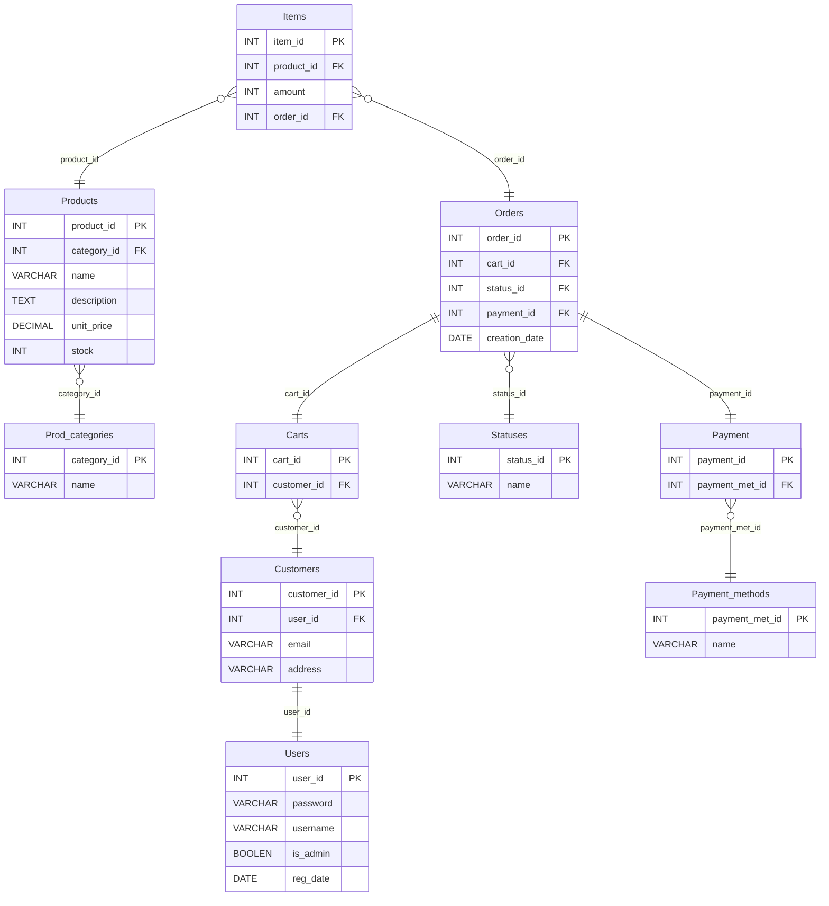

# Sistema de Gestión de una Tienda Online

Este proyecto es un sistema de gestión para una tienda online que permite a los usuarios interactuar con una variedad de productos, gestionar su carrito de compras, realizar pedidos y administrar su información personal. Además, proporciona funcionalidades para que los administradores gestionen productos, pedidos y usuarios.

## Requisitos Funcionales

### Registro de Usuarios
- Los usuarios deben poder registrarse proporcionando su nombre, dirección, correo electrónico y contraseña.
- Los usuarios deben poder iniciar sesión utilizando su correo electrónico y contraseña.

### Gestión de Productos
- Los productos deben tener un nombre, descripción, precio y cantidad en stock.
- Los productos deben poder añadirse, editarse y eliminarse.
- Debe ser posible buscar productos por nombre o categoría.

### Carrito de Compras
- Los usuarios deben poder añadir productos al carrito de compras.
- Los usuarios deben poder ver los productos en su carrito, modificar la cantidad o eliminar productos.
- Los usuarios deben poder finalizar la compra.

### Gestión de Pedidos
- Debe haber una lista de pedidos para cada usuario.
- Los usuarios deben poder ver el estado de sus pedidos (pendiente, enviado, entregado).
- Los administradores deben poder ver todos los pedidos y cambiar su estado.

### Interfaz de Administración
- Debe haber una interfaz de administración para gestionar productos, pedidos y usuarios.
- Los administradores deben poder agregar, editar y eliminar productos.
- Los administradores deben poder ver una lista de todos los usuarios y pedidos.

## Diagrama Entidad-Relación (ERD)
El siguiente diagrama muestra la estructura de la base de datos del sistema, destacando las relaciones entre las entidades clave:

