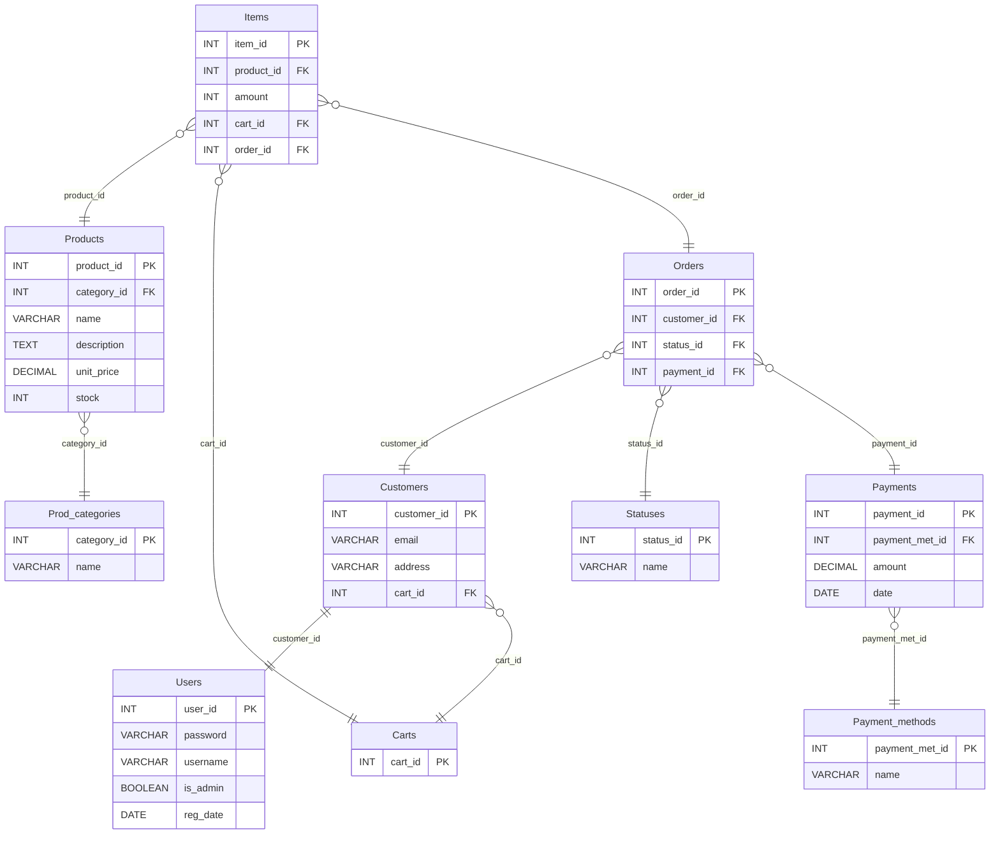

# Online Shop System

Este proyecto es un sistema de gestión para una tienda online que consta de dos aplicaciones:

1. **Panel de Administración de Escritorio**: Permite a los administradores gestionar los registros de la base de datos de productos y pedidos, así como ver los datos de los clientes.
2. **Aplicación Web**: Permite a los usuarios registrarse, iniciar sesión, ver productos disponibles, buscar productos, ver detalles de productos, añadir productos al carrito y finalizar pedidos. Los usuarios también pueden ver los detalles de su cuenta, historial de pedidos y estado, y cerrar sesión.

## Tecnologías Utilizadas

- **Maven**: Para la gestión de dependencias y construcción del proyecto.
- **Spring Boot**: Para la configuración y desarrollo de la aplicación.
- **Swing**: Para la interfaz de usuario de la aplicación de escritorio.
- **JSP**: Para la gestión de la base de datos.
- **Spring MVC**: Para el manejo de las solicitudes web.
- **Spring Security**: Para la gestión de la autenticación y autorización.
- **Thymeleaf**: Para la generación de vistas HTML en la aplicación web.
- **Jakarta Servlet**: Para el manejo de las solicitudes HTTP.

## Requisitos Funcionales

### Registro de Usuarios
- Los usuarios deben poder registrarse proporcionando su nombre, dirección, correo electrónico y contraseña.
- Los usuarios deben poder iniciar sesión utilizando su correo electrónico y contraseña.

### Gestión de Productos (Panel de Administración)
- Los productos deben tener un nombre, descripción, precio y cantidad en stock.
- Los productos deben poder añadirse, editarse y eliminarse.
- Debe ser posible buscar productos por nombre o categoría.

### Carrito de Compras (Aplicación Web)
- Los usuarios deben poder añadir productos al carrito de compras.
- Los usuarios deben poder ver los productos en su carrito, modificar la cantidad o eliminar productos.
- Los usuarios deben poder finalizar la compra.

### Gestión de Pedidos (Panel de Administración)
- Debe haber una lista de pedidos para cada usuario.
- Los administradores deben poder ver todos los pedidos y cambiar su estado.

### Gestión de Pedidos (Aplicación Web)
- Los usuarios deben poder ver el estado de sus pedidos (pendiente, enviado, entregado).

### Interfaz de Administración (Panel de Administración)
- Debe haber una interfaz de administración para gestionar productos, pedidos y usuarios.
- Los administradores deben poder agregar, editar y eliminar productos.
- Los administradores deben poder ver una lista de todos los usuarios y pedidos.

### Interfaz de Usuario (Aplicación Web)
- Los usuarios deben poder ver los productos disponibles.
- Los usuarios deben poder buscar productos por nombre o categoría.
- Los usuarios deben poder ver los detalles de los productos.
- Los usuarios deben poder ver los detalles de su cuenta.
- Los usuarios deben poder ver su historial de pedidos y el estado de los mismos.
- Los usuarios deben poder cerrar sesión.

## Diagrama Entidad-Relación (ERD)
El siguiente diagrama muestra la estructura de la base de datos del sistema, destacando las relaciones entre las entidades clave:



## Estructura del Proyecto
``` bash
TPI-PA-2
├── src
│   ├── main
│   │   ├── java
│   │   │   └── com
│   │   │       └── tpi
│   │   │           └── tpi
│   │   │               ├── common              # Clases compartidas entre las aplicaciones
│   │   │               │   ├── model           # Modelos de datos
│   │   │               │   ├── repository      # Repositorios para acceso a datos
│   │   │               │   └── service         # Servicios que manejan la lógica de negocio
│   │   │               ├── config              # Clases de configuración (Spring, etc.)
│   │   │               ├── desktop             # Aplicación de escritorio
│   │   │               │   ├── controller      # Controladores de la aplicación de escritorio
│   │   │               │   └── view            # Vistas (interfaz gráfica) de escritorio
│   │   │               ├── exception           # Manejo de excepciones
│   │   │               └── web                 # Aplicación web
│   │   │                   └── controller      # Controladores de la aplicación web
│   │   └── resources                           # Recursos estáticos y plantillas
│   │       ├── sql                             # Scripts SQL para crear el esquema y datos de prueba
│   │       ├── static                          # Archivos estáticos de la aplicación web
│   │       │   ├── css                         # Archivos de estilos CSS
│   │       │   └── images                      # Imágenes (como productos o logotipos)
│   │       └── templates                       # Plantillas HTML
│   │           └── fragments                   # Fragmentos dinámicos reutilizables en las vistas
```
## Guía de Instalación y Ejecución

### Clonar el repositorio
``` bash
git clone https://github.com/giulianoh92/TPI-PA-2.git
cd TPI-PA-2
```

### Configurar la base de datos
``` bash
CREATE DATABASE tpi_db;

mysql -u your_username -p tpi_db < src/main/resources/sql/ddl.sql
mysql -u your_username -p tpi_db < src/main/resources/sql/dml.sql
```
### Construir y empaquetar la aplicación
``` bash
mvn clean
mvn clean compile
mvn clean package
```
### Ejecutar la aplicación en modo escritorio
``` bash
java -jar target/TPI-1.0-SNAPSHOT.jar --app.mode=desktop
```
### Ejecutar la aplicación en modo aplicación web
``` bash
java -jar target/TPI-1.0-SNAPSHOT.jar --app.mode=webapp
```

